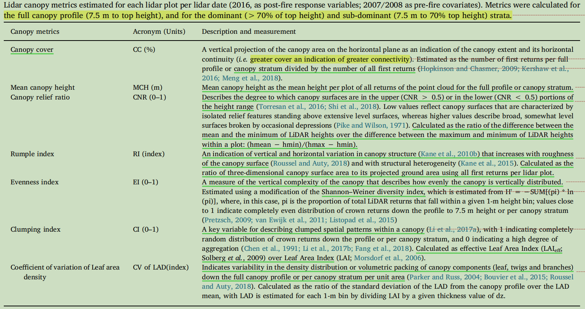
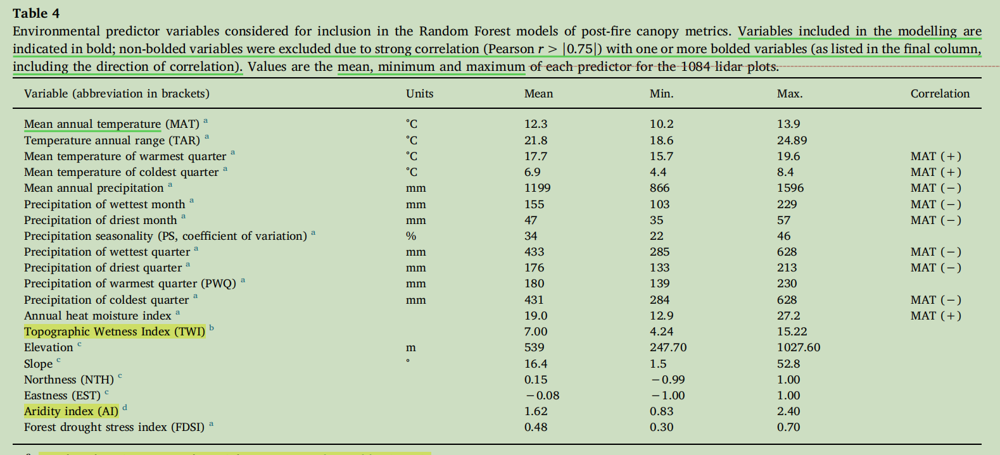

[TOC]

# Title

​	Persistent changes in the horizontal and vertical canopy structure of fire - tolerant forests after severe fire as quantified using multi-temporal airborne lidar data

​	基于多时相航空激光雷达数据量化耐火林林冠水平和垂直结构的持续变化

# Summary

​	在发生火灾的澳洲桉树森林，对不同的火烧烈度（未燃烧、轻度、中度、重度）的林分两次机载激光雷达数据进行采样分别获取到冠层前后的指标，对比不同的火烧烈度的冠层指标变化情况，将地形环境因子、冠层前期指标输入随机森林模型预测发生火灾后的冠层指标。

# Research Objective

​	1、了解火灾前后冠层指标变化情况

​	2、 了解环境因素对冠层变化的主要驱动情况

# Problem Statement

​	火灾前后冠层变化情况以及环境驱动因子

# Method(s)

​	1、按照火烧烈度图，对不同的火烧烈度进行分级抽样，获取出两期对齐过后激光雷达数据所有样地的点云数据，获取到所有样地的点云数据，进而计算出所有样地的火前、火后恢复的冠层指标。

​	2、将火前冠层指标、环境因素、地形因素结合随机森林模型预测火后冠层指标，进而解释三者之间关系

# Evaluation

在补充材料部分，作者对自己的方法中所利用到的各类冠层参数和实际值进行一个对比，确保获取到的参数是正确有意义的。

# Conclusion

## strong conclusion

​	1、我们的数据来自1000多个地块，代表~30000公顷的面积，提供了证据，证明在高强度火灾后，包括红色在内的耐火树冠持续发生景观规模的变化 覆盖，平均高度下降，以及一个更异质和支离破碎的上冠

​	2、在干燥地区，林冠恢复到7年的速度似乎较慢，这反过来可能更容易改变林下燃料的湿度和相关的可燃性。

## weak conclusion

​	暂无

# Notes

​	1、独立依赖图说明了火前和火后直接的变量关系

​	2、被动光谱指数恢复时间为6个月，光谱恢复不等于冠层植被上的恢复

​	3、严重的火灾，可能产生更为开放的植被类型

​	4、R 使用了随机森林(RF)和(CARET)两种包

​	5、varImpPlot 是随机森林重要性，'pdp' 是生成部分依赖图来表示单个解释变量与预测的冠层指标之间